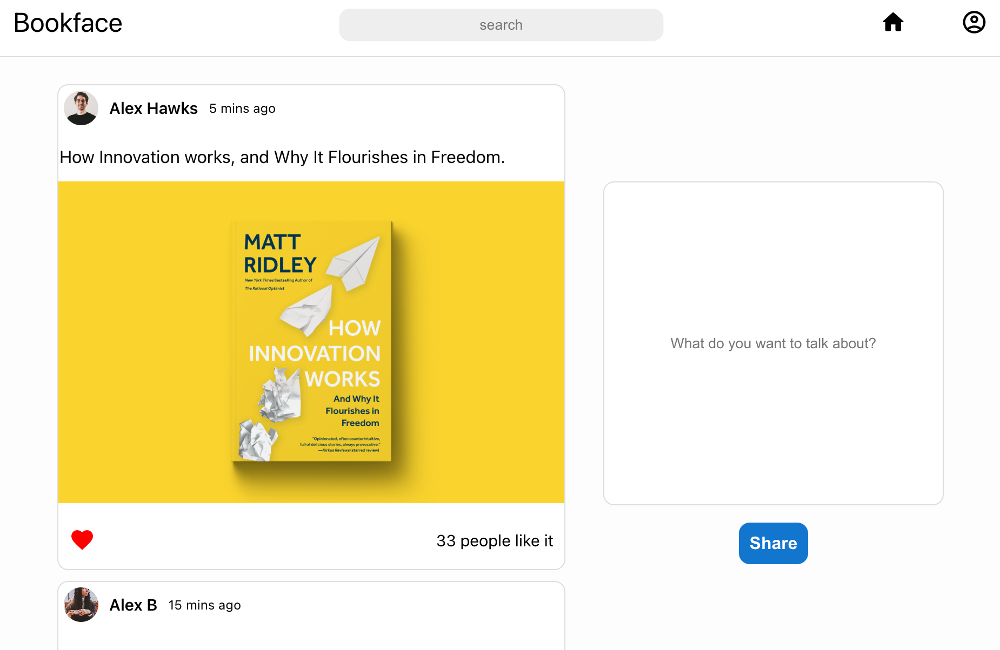
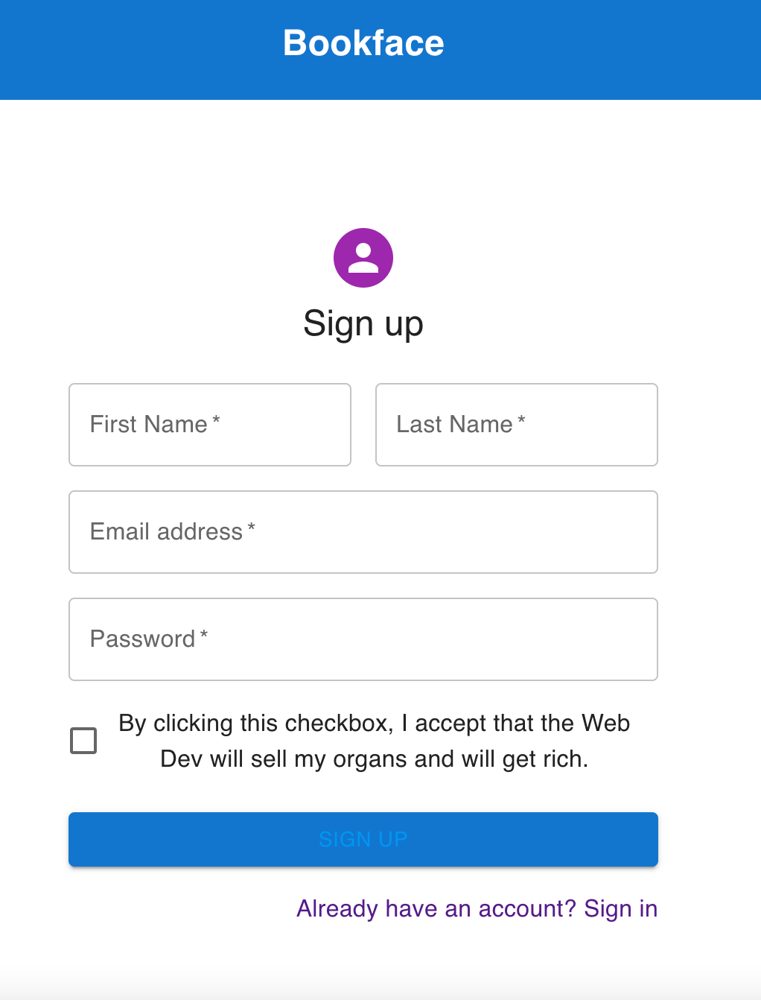

# BookFace

## Team collaborators:
- **Sophie Cheng**  
- **Bhama Guruswami**  
- **Arthur Pluym**  

### Mission:  
Good morning,   

If you receive this email, it means that you've been selected to carry on the development of my new (amazing) Web Platform.

I had this idea back in High school, but never had means to carry it out.

BookFace, "A place where friends can reconnect".

It's quite a simple application but I know it has the power to change the world.

The idea: When someone registers to the app, they can create a "Profile", then they can go to what I will call, their "floors", wich is a place where a user can post what they think, what they do, maybe a picture of them...

Then, they can use the space bar, to search for other persons using Bookface and check out what they posted on their floors.

I'm sure you are up for the task. you and I will shape the future together!

Zack Trurenberck.

### Learning objectives:   
**Collaborate in a project team (3p)**  
- Make the front of the application
- Setup, design and manage a database management system
- Translate a real-life usecase into a database model
- Discover a full app setup
- Model a simple non-relational DB model

#### Technologies used: Javascript, Typescript, React, Node JS, MongoDB Atlas

#### Roles: 
- Backend: Sophie*
- Frontend: Arthur, Bhama*   

*Note that each person tried to work on both backend and frontend features.

### Features:
- Register page
- Login page
- Hall => First page of the app, where all the new posts of all users are displayed

#### Pending: 
    - Connect the frontend and backend 
    - Improve the floor page, the design

### Preview:
#### Home
 

#### Register 

